# 🏗️ Arquitetura de Assinaturas e Empresas

> **Sistema completo de assinaturas vinculadas a usuários, com gerenciamento de múltiplas empresas limitadas por plano.**

---

## 📋 Índice

1. [Visão Geral](#visão-geral)
2. [Modelo de Negócio](#modelo-de-negócio)
3. [Planos e Limitações](#planos-e-limitações)
4. [Estrutura de Dados](#estrutura-de-dados)
5. [Sistema de Permissões](#sistema-de-permissões)
6. [API Endpoints](#api-endpoints)
7. [Fluxo de Usuário](#fluxo-de-usuário)
8. [Integração Frontend](#integração-frontend)
9. [Webhooks](#webhooks)
10. [Exemplos de Uso](#exemplos-de-uso)

---

## 🎯 Visão Geral

### Conceito Principal

```
USUÁRIO ASSINA
    ↓
CRIA EMPRESAS (limitadas por plano)
    ↓
CADA EMPRESA HERDA O PLANO
    ↓
ADICIONA MEMBROS ILIMITADOS
    ↓
MEMBROS TÊM PERMISSÕES GRANULARES
```

### Características

- ✅ **Assinatura por Usuário** - Cada usuário tem 1 assinatura
- ✅ **Múltiplas Empresas** - Limitadas por plano (0, 1, 3 ou 5)
- ✅ **Membros Ilimitados** - Cada empresa pode ter quantos membros quiser
- ✅ **Plano Herdado** - Empresa herda features do plano do owner
- ✅ **Permissões Granulares** - Role + Department + Custom

---

## 💼 Modelo de Negócio

### Fluxo Completo

```mermaid
graph TD
    A[Usuário se cadastra] --> B{Assinar?}
    B -->|Free| C[0 empresas]
    B -->|Starter| D[1 empresa]
    B -->|Professional| E[3 empresas]
    B -->|Enterprise| F[5 empresas]

    D --> G[Criar Empresa]
    E --> G
    F --> G

    G --> H[Adicionar Membros]
    H --> I[Definir Permissões]
    I --> J[Usar Plataforma]
```



### Exemplo Prático

**João (Professional):**
1. João assina plano **Professional** (R$ 97/mês)
2. João cria **3 empresas:**
   - Tech Corp (Vendas)
   - Consultoria XYZ (Serviços)
   - Startup ABC (Produto)
3. Cada empresa pode ter **membros ilimitados**:
   - Tech Corp: 25 membros
   - Consultoria XYZ: 8 membros
   - Startup ABC: 15 membros
4. **Total:** 48 membros usando o mesmo plano
5. **Billing:** R$ 97/mês para tudo

---

## 📊 Planos e Limitações

### Comparativo

| Feature | Free | Starter | Professional | Enterprise |
|---------|------|---------|--------------|------------|
| **Preço** | R$ 0 | R$ 47/mês | R$ 97/mês | R$ 297/mês |
| **Empresas** | 0 ❌ | 1 ✅ | 3 ✅ | 5 ✅ |
| **Membros** | ∞ | ∞ | ∞ | ∞ |
| **Storage** | 500MB | 10GB | 50GB | 500GB |
| **Integrações** | 0 | 2 | 10 | ∞ |
| **Automações** | 0 | 10 | 100 | ∞ |
| **CRM** | ❌ | ✅ | ✅ | ✅ |
| **Inbox** | ❌ | ✅ | ✅ | ✅ |
| **Reports** | ❌ | Básico | Avançado | Avançado |
| **IA** | ❌ | ❌ | ❌ | ✅ |
| **Whitelabel** | ❌ | ❌ | ❌ | ✅ |
| **API** | ❌ | ❌ | ❌ | ✅ |

### Plano FREE

- **Pode ser convidado** para empresas (ilimitado)
- **Não pode criar** empresas
- **UI:** Mostra botão "Criar Empresa" mas exige upgrade

### Regras de Upgrade/Downgrade

**Upgrade:**
- ✅ Sempre permitido
- ✅ Efeito imediato
- ✅ Empresas herdam novo plano automaticamente

**Downgrade:**
- ⚠️ Verificar quantidade de empresas criadas
- ⚠️ Se exceder limite, exigir exclusão antes
- ✅ Empresas restantes herdam novo plano

**Exemplo:**
```javascript
// Professional → Starter (3 empresas → 1 empresa)
if (companiesCreated > 1) {
  throw new Error('Você tem 3 empresas. Plano Starter permite apenas 1. Exclua 2 empresas antes de fazer downgrade.');
}
```

---

## 🗄️ Estrutura de Dados

### 1. User (Usuário)

```javascript
{
  _id: 'user-123',
  name: 'João Silva',
  email: 'joao@email.com',
  cpf: '123.456.789-00',

  // Referências (não armazenado aqui)
  // subscription -> Subscription.userId
  // ownedCompanies -> Company.ownerId
  // memberOfCompanies -> Company.members[].userId
}
```

### 2. Subscription (Assinatura)

```javascript
{
  _id: 'sub-456',
  userId: 'user-123', // ← Owner da assinatura

  // Plano
  plan: 'professional', // free | starter | professional | enterprise
  status: 'active', // active | suspended | canceled | past_due | trial

  // Billing
  billingCycle: 'monthly', // monthly | yearly
  startDate: '2024-01-15',
  currentPeriodStart: '2024-02-15',
  currentPeriodEnd: '2024-03-15',

  // Payment Gateway
  paymentGateway: 'stripe', // stripe | kiwify | hotmart | pix
  externalSubscriptionId: 'sub_stripe_abc123',
  externalCustomerId: 'cus_stripe_xyz789',

  // Trial
  trialEndsAt: '2024-01-22', // 7 dias trial

  // Uso (atualizado automaticamente)
  usage: {
    companiesCreated: 2, // Quantas empresas criou
    totalMembers: 15,    // Total de membros em todas empresas
    storageUsed: '15GB',
    integrationsActive: 5,
    automationsActive: 25
  },

  // Histórico de pagamentos
  paymentHistory: [
    {
      amount: 97,
      currency: 'BRL',
      status: 'paid',
      paidAt: '2024-02-15',
      invoiceUrl: 'https://...',
      transactionId: 'pi_abc123'
    }
  ]
}
```

### 3. Company (Empresa)

```javascript
{
  _id: 'company-789',
  name: 'Tech Corp',
  slug: 'tech-corp', // Gerado automaticamente
  logo: 'https://...',
  description: 'Empresa de tecnologia',

  // Owner (quem criou e paga)
  ownerId: 'user-123',

  // Plano herdado
  inheritedPlan: 'professional', // Copiado de user.subscription.plan

  // Status
  status: 'active', // active | suspended | archived

  // Membros (ILIMITADOS)
  members: [
    {
      userId: 'user-123',
      role: 'owner', // owner | admin | member
      department: null, // Owner não tem departamento
      permissions: ['all'],
      joinedAt: '2024-01-15',
      invitedBy: null
    },
    {
      userId: 'user-456',
      role: 'admin',
      department: 'vendas',
      permissions: ['crm.view', 'crm.create', 'crm.edit', 'contacts.view', 'reports.view'],
      joinedAt: '2024-01-20',
      invitedBy: 'user-123'
    },
    {
      userId: 'user-789',
      role: 'member',
      department: 'suporte',
      permissions: ['inbox.view', 'inbox.send', 'contacts.view'],
      joinedAt: '2024-01-25',
      invitedBy: 'user-456'
    }
  ],

  // Configurações
  settings: {
    primaryColor: '#9333ea',
    secondaryColor: '#a855f7',
    timezone: 'America/Sao_Paulo',
    language: 'pt-BR',
    currency: 'BRL',

    // Whitelabel (apenas Enterprise)
    whitelabel: {
      enabled: false,
      companyName: null,
      favicon: null
    },

    customDomain: null, // apenas Enterprise

    notifications: {
      email: true,
      push: true,
      slack: {
        enabled: false,
        webhookUrl: null
      }
    }
  },

  // Estatísticas
  usage: {
    totalMembers: 3,
    storageUsed: 5000000, // bytes
    contactsCount: 150,
    messagesCount: 450,
    integrationsCount: 3,
    automationsCount: 12
  },

  // Billing Info (CNPJ, endereço)
  billingInfo: {
    cnpj: '12.345.678/0001-90',
    razaoSocial: 'Tech Corp LTDA',
    address: {
      street: 'Av. Paulista',
      number: '1000',
      city: 'São Paulo',
      state: 'SP',
      zipCode: '01310-100'
    }
  }
}
```

---

## 🔐 Sistema de Permissões

### Hierarquia de Permissões

```
1. OWNER (tudo)
   ↓
2. ADMIN (quase tudo)
   ↓
3. MEMBER (limitado) + DEPARTMENT (específico)
   ↓
4. CUSTOM PERMISSIONS (override)
```

### Roles

**OWNER:**
- Permissão: `['all']`
- Pode: TUDO (gerenciar empresa, billing, deletar)
- Não pode ser removido
- Não pode ter role alterado

**ADMIN:**
- Pode: Gerenciar membros, configurações, todos recursos
- Não pode: Acessar billing, deletar empresa, mudar whitelabel

**MEMBER:**
- Pode: Visualizar, usar recursos básicos
- Definido por: Role + Department

### Departamentos

```javascript
const DEPARTMENTS = {
  vendas: ['crm', 'contacts', 'reports'],
  suporte: ['inbox', 'contacts'],
  marketing: ['contacts', 'reports', 'automations', 'ia'],
  financeiro: ['reports', 'billing'],
  ti: ['integrations', 'settings', 'api']
};
```

### Exemplo de Permissões

```javascript
// Usuário: Maria (Admin, Vendas)
const permissions = getMemberPermissions('admin', 'vendas', []);

// Resultado:
[
  'dashboard.view',
  'crm.view', 'crm.create', 'crm.edit', 'crm.delete', 'crm.export',
  'contacts.view', 'contacts.create', 'contacts.edit',
  'inbox.view', 'inbox.send',
  'reports.view', 'reports.export',
  // ... todas as permissões de admin + vendas
]

// Verificar permissão
hasPermission(permissions, 'crm.delete'); // true
hasPermission(permissions, 'settings.billing'); // false
```

---

## 🔌 API Endpoints

### Subscription

```javascript
// Obter assinatura do usuário
GET /api/subscriptions/me

// Criar assinatura
POST /api/subscriptions
{
  "plan": "professional",
  "paymentGateway": "stripe",
  "externalSubscriptionId": "sub_abc123"
}

// Upgrade
PATCH /api/subscriptions/upgrade
{
  "newPlan": "enterprise"
}

// Downgrade
PATCH /api/subscriptions/downgrade
{
  "newPlan": "starter"
}

// Cancelar
POST /api/subscriptions/cancel

// Reativar
POST /api/subscriptions/reactivate

// Verificar se pode criar empresa
GET /api/subscriptions/can-create-company

// Estatísticas de uso
GET /api/subscriptions/stats
```

### Companies

```javascript
// Listar empresas do usuário
GET /api/companies/my-companies

// Criar empresa
POST /api/companies
{
  "name": "Tech Corp",
  "description": "Empresa de tecnologia",
  "logo": "https://..."
}

// Obter empresa
GET /api/companies/:id

// Atualizar empresa
PATCH /api/companies/:id
{
  "name": "Tech Corp 2.0",
  "settings": {
    "primaryColor": "#ff0000"
  }
}

// Deletar empresa (soft delete)
DELETE /api/companies/:id
```

### Members

```javascript
// Listar membros
GET /api/companies/:id/members

// Adicionar membro
POST /api/companies/:id/members
{
  "email": "maria@email.com",
  "role": "admin",
  "department": "vendas",
  "permissions": ["crm.view", "crm.create"]
}

// Atualizar membro
PATCH /api/companies/:id/members/:userId
{
  "role": "member",
  "department": "suporte",
  "permissions": ["inbox.view", "inbox.send"]
}

// Remover membro
DELETE /api/companies/:id/members/:userId
```

---

## 🚀 Fluxo de Usuário

### 1. Novo Usuário (Free)

```javascript
// Cadastro
POST /api/auth/register
{
  "name": "João Silva",
  "email": "joao@email.com",
  "password": "123456"
}

// Sistema cria automaticamente:
// - User
// - Subscription (plan: 'free', status: 'trial')

// Usuário tenta criar empresa
POST /api/companies
{
  "name": "Minha Empresa"
}

// Resposta:
{
  "success": false,
  "message": "Você atingiu o limite de 0 empresa(s) do plano free",
  "action": "subscribe", // ← Frontend mostra modal de upgrade
  "currentPlan": "free",
  "companiesCreated": 0,
  "maxCompanies": 0
}
```

### 2. Assinatura Starter

```javascript
// Fazer upgrade
PATCH /api/subscriptions/upgrade
{
  "newPlan": "starter"
}

// Sistema:
// - Atualiza subscription.plan = 'starter'
// - Atualiza subscription.status = 'active'
// - Define subscription.currentPeriodEnd = +30 dias

// Criar empresa
POST /api/companies
{
  "name": "Tech Corp"
}

// Resposta:
{
  "success": true,
  "message": "Empresa criada com sucesso",
  "data": {
    "_id": "company-123",
    "name": "Tech Corp",
    "slug": "tech-corp",
    "inheritedPlan": "starter", // ← Herdado
    "ownerId": "user-123",
    "members": [
      {
        "userId": "user-123",
        "role": "owner",
        "permissions": ["all"]
      }
    ]
  }
}

// Sistema também:
// - Incrementa subscription.usage.companiesCreated = 1
```

### 3. Adicionar Membros

```javascript
// Adicionar membro
POST /api/companies/company-123/members
{
  "email": "maria@email.com",
  "role": "admin",
  "department": "vendas",
  "permissions": [] // Vazio = usa permissões padrão de admin + vendas
}

// Sistema:
// 1. Busca User por email
// 2. Adiciona ao array company.members
// 3. Incrementa company.usage.totalMembers
// 4. Envia email de convite para maria@email.com
```

### 4. Maria Aceita Convite

```javascript
// Maria faz login
// GET /api/companies/my-companies

// Resposta:
{
  "success": true,
  "data": {
    "owned": [], // Maria não é owner de nenhuma
    "member": [  // Maria é membro de:
      {
        "_id": "company-123",
        "name": "Tech Corp",
        "inheritedPlan": "starter",
        "role": "admin",
        "department": "vendas",
        "permissions": ['crm.view', 'crm.create', ...]
      }
    ]
  }
}
```

---

## 💻 Integração Frontend

### 1. Context Global (App.jsx)

```javascript
// src/contexts/SubscriptionContext.jsx
import { createContext, useContext, useState, useEffect } from 'react';
import api from '../services/api';

const SubscriptionContext = createContext();

export const SubscriptionProvider = ({ children }) => {
  const [subscription, setSubscription] = useState(null);
  const [companies, setCompanies] = useState([]);
  const [currentCompany, setCurrentCompany] = useState(null);
  const [loading, setLoading] = useState(true);

  useEffect(() => {
    fetchSubscription();
    fetchCompanies();
  }, []);

  const fetchSubscription = async () => {
    try {
      const { data } = await api.get('/api/subscriptions/me');
      setSubscription(data.data);
    } catch (error) {
      console.error('Error fetching subscription:', error);
    }
  };

  const fetchCompanies = async () => {
    try {
      const { data } = await api.get('/api/companies/my-companies');
      setCompanies([...data.data.owned, ...data.data.member]);

      // Definir empresa atual (primeira da lista ou localStorage)
      const savedCompanyId = localStorage.getItem('currentCompanyId');
      const company = companies.find(c => c._id === savedCompanyId) || companies[0];
      setCurrentCompany(company);
    } catch (error) {
      console.error('Error fetching companies:', error);
    } finally {
      setLoading(false);
    }
  };

  const switchCompany = (companyId) => {
    const company = companies.find(c => c._id === companyId);
    if (company) {
      setCurrentCompany(company);
      localStorage.setItem('currentCompanyId', companyId);
    }
  };

  const canCreateCompany = () => {
    if (!subscription) return false;

    const LIMITS = {
      free: 0,
      starter: 1,
      professional: 3,
      enterprise: 5,
    };

    const ownedCompanies = companies.filter(c => c.ownerId === user._id);
    return ownedCompanies.length < LIMITS[subscription.plan];
  };

  return (
    <SubscriptionContext.Provider value={{
      subscription,
      companies,
      currentCompany,
      switchCompany,
      canCreateCompany,
      loading,
      refetch: () => {
        fetchSubscription();
        fetchCompanies();
      }
    }}>
      {children}
    </SubscriptionContext.Provider>
  );
};

export const useSubscription = () => useContext(SubscriptionContext);
```

### 2. Company Switcher (Sidebar)

```javascript
// src/components/CompanySwitcher.jsx
import { useSubscription } from '../contexts/SubscriptionContext';
import { FaBuilding, FaPlus } from 'react-icons/fa';

const CompanySwitcher = () => {
  const { companies, currentCompany, switchCompany, canCreateCompany } = useSubscription();

  return (
    <div className="p-4 border-b">
      <select
        value={currentCompany?._id}
        onChange={(e) => switchCompany(e.target.value)}
        className="w-full px-3 py-2 rounded-lg border"
      >
        {companies.map(company => (
          <option key={company._id} value={company._id}>
            {company.name} {company.role === 'owner' ? '(Owner)' : '(Member)'}
          </option>
        ))}
      </select>

      <button
        onClick={() => {
          if (canCreateCompany()) {
            // Abrir modal de criar empresa
          } else {
            // Mostrar modal de upgrade
          }
        }}
        className="mt-2 w-full px-3 py-2 bg-purple-600 text-white rounded-lg"
      >
        <FaPlus /> Nova Empresa
      </button>
    </div>
  );
};
```

### 3. Protected Features

```javascript
// src/hooks/useFeature.js
import { useSubscription } from '../contexts/SubscriptionContext';
import { canAccessFeature } from '../config/permissions';

export const useFeature = (featureName) => {
  const { currentCompany } = useSubscription();

  if (!currentCompany) return false;

  return canAccessFeature(currentCompany.inheritedPlan, featureName);
};

// Uso:
const Dashboard = () => {
  const hasIA = useFeature('ia');
  const hasReports = useFeature('reports');

  return (
    <div>
      {hasReports && <ReportsWidget />}
      {hasIA && <IAAssistant />}
      {!hasIA && <UpgradeBanner feature="IA" />}
    </div>
  );
};
```

### 4. Permission Guard

```javascript
// src/hooks/usePermission.js
import { useSubscription } from '../contexts/SubscriptionContext';
import { hasPermission as checkPermission } from '../config/permissions';

export const usePermission = (permission) => {
  const { currentCompany } = useSubscription();
  const { user } = useAuth();

  if (!currentCompany) return false;

  const member = currentCompany.members.find(m => m.userId === user._id);
  if (!member) return false;

  return checkPermission(member.permissions, permission);
};

// Uso:
const CRM = () => {
  const canDelete = usePermission('crm.delete');

  return (
    <div>
      {canDelete && (
        <button onClick={handleDelete}>Deletar</button>
      )}
    </div>
  );
};
```

---

## 🎨 Componentes de UI

### CreateCompanyModal

```javascript
// src/components/Modals/CreateCompanyModal.jsx
import { useState } from 'react';
import { useSubscription } from '../../contexts/SubscriptionContext';
import api from '../../services/api';

const CreateCompanyModal = ({ onClose }) => {
  const { canCreateCompany, refetch } = useSubscription();
  const [name, setName] = useState('');
  const [loading, setLoading] = useState(false);

  const handleCreate = async () => {
    if (!canCreateCompany()) {
      // Mostrar modal de upgrade
      return;
    }

    setLoading(true);
    try {
      await api.post('/api/companies', { name });
      refetch();
      onClose();
    } catch (error) {
      console.error(error);
      alert(error.response?.data?.message || 'Erro ao criar empresa');
    } finally {
      setLoading(false);
    }
  };

  return (
    <div className="modal">
      <h2>Criar Nova Empresa</h2>

      <input
        type="text"
        value={name}
        onChange={(e) => setName(e.target.value)}
        placeholder="Nome da empresa"
      />

      <button onClick={handleCreate} disabled={loading}>
        {loading ? 'Criando...' : 'Criar Empresa'}
      </button>
    </div>
  );
};
```

### UpgradePrompt

```javascript
// src/components/UpgradePrompt.jsx
import { useSubscription } from '../contexts/SubscriptionContext';
import { PLANS, suggestUpgrade } from '../config/plans';

const UpgradePrompt = ({ feature }) => {
  const { subscription } = useSubscription();
  const nextPlan = suggestUpgrade(subscription?.plan);

  if (!nextPlan) return null;

  return (
    <div className="bg-purple-50 border border-purple-200 rounded-lg p-4">
      <h3 className="font-bold text-purple-900">
        {feature} disponível no plano {nextPlan.name}
      </h3>
      <p className="text-sm text-purple-700 mt-2">
        Faça upgrade para desbloquear esta funcionalidade
      </p>
      <button className="mt-3 px-4 py-2 bg-purple-600 text-white rounded-lg">
        Fazer Upgrade - {nextPlan.price}/mês
      </button>
    </div>
  );
};
```

---

## 📚 Exemplos Completos

### Exemplo 1: Criar Empresa

```javascript
// Frontend
const handleCreateCompany = async () => {
  // 1. Verificar se pode criar
  const canCreate = await api.get('/api/subscriptions/can-create-company');

  if (!canCreate.data.canCreate) {
    if (canCreate.data.reason === 'no_subscription') {
      showModal('SubscribeModal');
    } else if (canCreate.data.reason === 'limit_reached') {
      showModal('UpgradeModal', {
        message: canCreate.data.message,
        currentPlan: canCreate.data.currentPlan
      });
    }
    return;
  }

  // 2. Criar empresa
  try {
    const response = await api.post('/api/companies', {
      name: 'Tech Corp',
      description: 'Empresa de tecnologia'
    });

    console.log('Empresa criada:', response.data.data);

    // 3. Atualizar UI
    refetchCompanies();
    switchCompany(response.data.data._id);
  } catch (error) {
    console.error(error);
  }
};
```

### Exemplo 2: Adicionar Membro

```javascript
const handleAddMember = async (companyId, memberData) => {
  try {
    await api.post(`/api/companies/${companyId}/members`, {
      email: memberData.email,
      role: memberData.role,
      department: memberData.department,
      permissions: memberData.permissions
    });

    // Atualizar lista de membros
    refetchMembers();
  } catch (error) {
    if (error.response?.status === 403) {
      alert('Você não tem permissão para adicionar membros');
    }
  }
};
```

### Exemplo 3: Verificar Permissão

```javascript
// No componente
const CRMPage = () => {
  const canEdit = usePermission('crm.edit');
  const canDelete = usePermission('crm.delete');

  return (
    <div>
      <h1>CRM</h1>

      {canEdit && (
        <button onClick={handleEdit}>Editar</button>
      )}

      {canDelete && (
        <button onClick={handleDelete}>Deletar</button>
      )}
    </div>
  );
};
```

---

## 🎯 Checklist de Implementação

### Backend

- [x] ✅ Models (Subscription, Company)
- [x] ✅ Controllers (subscriptionController, companyController)
- [x] ✅ Routes (subscriptionRoutes, companyRoutes)
- [ ] ⏳ Middleware de permissões
- [ ] ⏳ Webhooks (Stripe, Kiwify, Hotmart)
- [ ] ⏳ Testes unitários

### Frontend

- [x] ✅ Config (plans.js, permissions.js)
- [ ] ⏳ SubscriptionContext
- [ ] ⏳ CompanySwitcher
- [ ] ⏳ CreateCompanyModal
- [ ] ⏳ UpgradePrompt
- [ ] ⏳ Hooks (useFeature, usePermission)
- [ ] ⏳ Integrar em todas as páginas

### Superadmin

- [ ] ⏳ Exibir assinatura do owner (não de cada user)
- [ ] ⏳ Mostrar empresas criadas por usuário
- [ ] ⏳ Gerenciar assinaturas
- [ ] ⏳ Forçar upgrade/downgrade

---

## 🚀 Próximos Passos

1. **Implementar SubscriptionContext** - Context global
2. **Criar CompanySwitcher** - Dropdown na sidebar
3. **Adaptar todas as páginas** - Usar currentCompany
4. **Implementar guards** - Verificar features/permissions
5. **Criar modais** - CreateCompany, Upgrade, InviteMember
6. **Integrar webhooks** - Stripe, Kiwify, Hotmart
7. **Testes** - Testar todos os fluxos

---

**Documentação criada em:** 2026-02-25
**Versão:** 1.0
**Status:** ✅ Arquitetura definida, implementação em andamento
