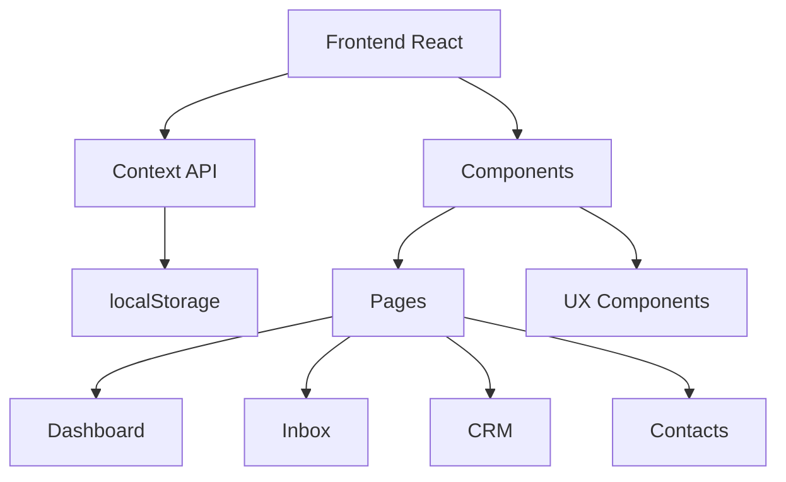

# 📋 Visão Geral do Projeto

> **Plataforma CRM Completa** - Sistema integrado de gestão de relacionamento com clientes

---

## 🎯 Objetivo

Desenvolver uma plataforma CRM 100% funcional que integre:
- Gestão de contatos
- Pipeline de vendas visual
- Sistema de mensagens (Inbox)
- Integrações com plataformas de pagamento
- Gestão de equipe e empresas
- Assistente de IA

---

## 🌟 Diferenciais

### 1. **Tema Purple Elegante**
- Gradientes de roxo (#9333ea)
- Dark mode nativo
- Design moderno e profissional

### 2. **Integrações Nativas**
- [[08-Integrations#Kiwify|Kiwify]] - Plataforma de vendas
- [[08-Integrations#Hotmart|Hotmart]] - Marketplace digital
- [[08-Integrations#Stripe|Stripe]] - Gateway de pagamento
- WhatsApp Business API
- Instagram, Facebook, Email

### 3. **UX Premium**
- Loading states elegantes
- Skeleton loaders
- Tooltips informativos
- Empty states descritivos
- Transições suaves

### 4. **Sistema de Anexos**
- 📸 Imagens com preview
- 🎵 Player de áudio integrado
- 📄 Documentos PDF
- 🎬 Player de vídeo

---

## 🏗️ Arquitetura



### **Stack Principal**
- **Frontend:** React 18
- **Build Tool:** Vite
- **Styling:** Tailwind CSS
- **Icons:** React Icons
- **State:** Context API + localStorage
- **Router:** React Router DOM

---

## 📊 Estrutura de Páginas

### **1. Dashboard** → [[04-Dashboard]]
- Métricas principais (conversas, leads, vendas)
- Gráficos de performance
- Últimas atividades
- Quick actions

### **2. Inbox** → [[05-Inbox]]
- Lista de conversas
- Chat em tempo real (mockado)
- [[19-Anexos-Inbox|Anexos]] (imagem, áudio, documento, vídeo)
- [[20-Enviar-para-CRM|Enviar para CRM]]
- Respostas rápidas
- Atribuição de atendentes

### **3. CRM** → [[06-CRM]]
- Pipelines personalizáveis
- Drag-and-drop de cards
- Filtros avançados
- [[23-Persistencia-CRM|Persistência automática]]

### **4. Contacts** → [[07-Contacts]]
- Tabela de contatos
- [[21-CSV-Import-Export|Import/Export CSV]]
- Tags e segmentação
- Histórico de interações

### **5. Integrações** → [[08-Integrations]]
- Kiwify (conectar com API)
- Hotmart (conectar com API)
- [[22-Validacao-Credenciais|Validação de credenciais]]
- Webhooks configuráveis

### **6. Team** → [[09-Team]]
- Gestão de membros
- Permissões por setor
- Carga horária
- Status online/offline

### **7. Companies** → [[10-Companies]]
- Multi-empresa
- Switch entre empresas
- Edição de dados
- Logo upload

### **8. IA** → [[11-IA]]
- Assistente conversacional
- Sugestões automáticas
- Análise de sentimento

### **9. Knowledge Base** → [[12-Knowledge-Base]]
- Artigos de ajuda
- Categorias
- Busca full-text

---

## 🎨 Identidade Visual

### **Cores Principais**
```css
/* Purple Theme */
--purple-50: #faf5ff
--purple-500: #9333ea
--purple-600: #7e22ce
--purple-700: #6b21a8
--purple-900: #581c87

/* Destructive Actions */
--red-600: #dc2626
```

### **Typography**
- **Font:** System fonts (Inter, Segoe UI, Helvetica)
- **Heading:** font-bold
- **Body:** font-normal
- **Code:** font-mono

---

## 📱 Responsividade

### **Breakpoints**
- Mobile: `< 768px`
- Tablet: `768px - 1024px`
- Desktop: `> 1024px`

### **Features Responsivas**
- Menu hamburger em mobile
- Tabelas com scroll horizontal
- Modais full-screen em mobile
- Touch-friendly buttons

---

## 🔐 Segurança

### **Implementado**
- Validação de credenciais de API
- localStorage seguro
- Sanitização de inputs

### **Planejado (Backend)**
- JWT Authentication
- Rate limiting
- HTTPS obrigatório
- Criptografia de dados sensíveis

---

## 📈 Roadmap

### **Q1 2026** ✅
- [x] MVP funcional
- [x] Integrações básicas
- [x] Sistema de anexos
- [x] Componentes UX

### **Q2 2026** 🚧
- [ ] Backend Node.js
- [ ] API REST
- [ ] Webhooks reais
- [ ] Autenticação JWT

### **Q3 2026** 📅
- [ ] Mobile App (React Native)
- [ ] Push Notifications
- [ ] Analytics avançado
- [ ] Automações de IA

---

## 🤝 Contribuindo

Veja [[28-Convencoes-Codigo]] para padrões de código e [[29-Git-Workflow]] para fluxo de trabalho.

---

## 🔗 Links Úteis

- [[02-Arquitetura]] - Arquitetura detalhada
- [[03-Stack-Tecnologico]] - Stack completo
- [[27-Setup-Ambiente]] - Como configurar
- [[31-Guia-Usuario]] - Guia do usuário

---

[[00-INDEX|← Voltar ao Índice]]
