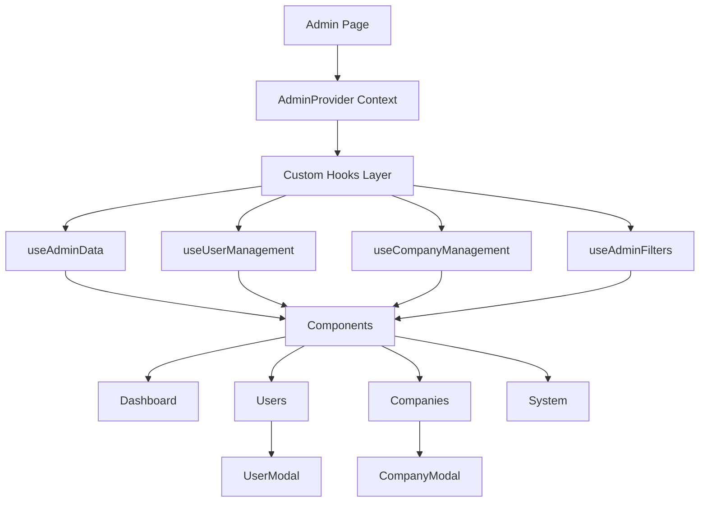

# 🏗️ Plano de Refatoração - Painel Superadmin

> **Status:** 🟡 Em Progresso
> **Data Início:** 2026-02-25
> **Estimativa:** 5-7 dias (42-55 horas)
> **Story:** [[Story 4.1 - Superadmin Complete Overhaul]]

---

## 📊 Visão Geral

### Estado Atual
- **Arquivo:** `src/pages/Admin.jsx`
- **Tamanho:** 2.939 linhas | ~166KB | 49.9k tokens
- **Complexidade:** 🔴 Alta
- **Problemas Críticos:**
  - 33+ estados locais não organizados
  - Código monolítico sem modularização
  - 0% cobertura de testes
  - Performance degradada (muitos re-renders)
  - Sem tratamento robusto de erros
  - Acessibilidade limitada

### Objetivo Final
- **Estrutura Modular:** 60+ componentes organizados
- **State Management:** Context API + Custom Hooks
- **Performance:** React.memo, useMemo, lazy loading
- **Testes:** > 80% coverage
- **Acessibilidade:** WCAG 2.1 AA compliant
- **Bundle Size:** < 200KB

---

## 🗂️ Estrutura Proposta

```
src/pages/Admin/
├── index.jsx                    # Orquestrador principal
├── context/
│   └── AdminContext.jsx         # Estado global
├── hooks/
│   ├── useAdminData.js          # Dados gerais
│   ├── useUserManagement.js     # CRUD usuários
│   ├── useCompanyManagement.js  # CRUD empresas
│   ├── useMemberManagement.js   # CRUD membros
│   ├── useAdminFilters.js       # Filtros e busca
│   ├── useAdminTheme.js         # Gerenciamento de tema
│   ├── useSystemIntegrations.js # Integrações
│   ├── useSystemLogs.js         # Logs
│   └── usePermissions.js        # Permissões
├── components/
│   ├── Dashboard/
│   │   ├── StatCard.jsx
│   │   ├── MetricsSection.jsx
│   │   ├── PlanDistribution.jsx
│   │   ├── PlatformHealth.jsx
│   │   ├── RecentCompanies.jsx
│   │   └── RecentUsers.jsx
│   ├── Users/
│   │   ├── UsersHeader.jsx
│   │   ├── UsersSearchBar.jsx
│   │   ├── UsersFilters.jsx
│   │   ├── UsersTable.jsx
│   │   └── UserModal/
│   │       ├── index.jsx
│   │       ├── InfoTab.jsx
│   │       ├── ConfigTab.jsx
│   │       ├── ActionsTab.jsx
│   │       └── PermissionsPanel.jsx
│   ├── Companies/
│   │   ├── CompaniesHeader.jsx
│   │   ├── CompaniesStats.jsx
│   │   ├── CompaniesFilters.jsx
│   │   ├── CompaniesTable.jsx
│   │   └── CompanyModal/
│   │       ├── index.jsx
│   │       ├── DetailsTab.jsx
│   │       ├── MembersTab/
│   │       ├── PlanActionsTab.jsx
│   │       └── SettingsTab/
│   ├── System/
│   │   ├── IntegrationsTab.jsx
│   │   ├── LogsTab.jsx
│   │   ├── AnalyticsTab.jsx
│   │   └── SettingsTab/
│   └── Shared/
│       ├── AdminSidebar.jsx
│       ├── AdminHeader.jsx
│       ├── ThemeToggle.jsx
│       ├── StatusBadge.jsx
│       ├── PlanBadge.jsx
│       ├── RoleBadge.jsx
│       ├── DataTable.jsx
│       ├── FilterBar.jsx
│       ├── SearchInput.jsx
│       ├── ModalBackdrop.jsx
│       └── EmptyState.jsx
├── utils/
│   ├── constants.js
│   ├── mockData.js
│   ├── adminHelpers.js
│   ├── validators.js
│   └── formatters.js
└── types/
    └── admin.types.js
```

---

## 🔄 Fluxo de Dados



---

## 📋 Fases de Implementação

### [[Fase 1 - Preparação]] (Dia 1 - 2-3h)
- [x] Criar estrutura de pastas
- [ ] Criar `utils/constants.js`
- [ ] Criar `utils/mockData.js`
- [ ] Criar `types/admin.types.js`
- [ ] Criar `context/AdminContext.jsx`

**Arquivos Críticos:**
- `context/AdminContext.jsx` - Base de toda refatoração

### [[Fase 2 - Shared Components]] (Dia 1-2 - 4-6h)
- [ ] `Shared/StatusBadge.jsx`
- [ ] `Shared/PlanBadge.jsx`
- [ ] `Shared/RoleBadge.jsx`
- [ ] `Shared/StatCard.jsx`
- [ ] `Shared/SearchInput.jsx`
- [ ] `Shared/FilterBar.jsx`
- [ ] `Shared/DataTable.jsx`
- [ ] `Shared/ModalBackdrop.jsx`
- [ ] `Shared/EmptyState.jsx`
- [ ] `Shared/AdminSidebar.jsx`
- [ ] `Shared/ThemeToggle.jsx`

**Componente Teste:** AdminSidebar (mais isolado)

### [[Fase 3 - Custom Hooks]] (Dia 2 - 6-8h)
- [ ] `hooks/useAdminData.js`
- [ ] `hooks/useUserManagement.js`
- [ ] `hooks/useCompanyManagement.js`
- [ ] `hooks/useMemberManagement.js`
- [ ] `hooks/useAdminFilters.js`
- [ ] `hooks/useAdminTheme.js`
- [ ] `hooks/usePermissions.js`
- [ ] `hooks/useSystemIntegrations.js`
- [ ] `hooks/useSystemLogs.js`

**Hook Crítico:** useAdminData (desacopla dados)

### [[Fase 4 - Tab Components]] (Dia 2-3 - 8-10h)
#### Dashboard (mais simples)
- [ ] `Dashboard/MetricsSection.jsx`
- [ ] `Dashboard/PlanDistribution.jsx`
- [ ] `Dashboard/PlatformHealth.jsx`
- [ ] `Dashboard/RecentCompanies.jsx`
- [ ] `Dashboard/RecentUsers.jsx`

#### Users
- [ ] `Users/UsersHeader.jsx`
- [ ] `Users/UsersSearchBar.jsx`
- [ ] `Users/UsersFilters.jsx`
- [ ] `Users/UsersTable.jsx`

#### Companies
- [ ] `Companies/CompaniesHeader.jsx`
- [ ] `Companies/CompaniesStats.jsx`
- [ ] `Companies/CompaniesFilters.jsx`
- [ ] `Companies/CompaniesTable.jsx`

#### System
- [ ] `System/IntegrationsTab.jsx`
- [ ] `System/LogsTab.jsx`
- [ ] `System/AnalyticsTab.jsx`
- [ ] `System/SettingsTab/` (dividir)

### [[Fase 5 - Modais]] (Dia 3-4 - 12-14h) 🔴 COMPLEXO
#### UserModal
- [ ] `UserModal/index.jsx`
- [ ] `UserModal/InfoTab.jsx`
- [ ] `UserModal/ConfigTab.jsx`
- [ ] `UserModal/ActionsTab.jsx`
- [ ] `UserModal/PermissionsPanel.jsx`

#### CompanyModal (MAIS COMPLEXO)
- [ ] `CompanyModal/index.jsx`
- [ ] `CompanyModal/DetailsTab.jsx`
- [ ] `CompanyModal/MembersTab/index.jsx`
- [ ] `CompanyModal/MembersTab/MembersList.jsx`
- [ ] `CompanyModal/MembersTab/MemberCard.jsx`
- [ ] `CompanyModal/MembersTab/MemberEditModal.jsx`
- [ ] `CompanyModal/PlanActionsTab.jsx`
- [ ] `CompanyModal/SettingsTab/index.jsx`
- [ ] `CompanyModal/SettingsTab/CargosSection.jsx`
- [ ] `CompanyModal/SettingsTab/SetoresSection.jsx`
- [ ] `CompanyModal/SettingsTab/RolesSection.jsx`

### [[Fase 6 - Integração]] (Dia 4-5 - 4-6h)
- [ ] Refatorar `index.jsx` principal
- [ ] Adicionar React.memo
- [ ] Implementar useMemo/useCallback
- [ ] Adicionar React.lazy para modais
- [ ] Criar Error Boundaries

### [[Fase 7 - Testes]] (Dia 5 - 6-8h)
- [ ] Testes unitários de hooks
- [ ] Testes de componentes shared
- [ ] Testes de integração (CRUD)
- [ ] Testes de acessibilidade
- [ ] Validação manual (dark mode, responsivo)

---

## 🎯 Decisões Arquiteturais

### State Management: Context API + Custom Hooks

**Decisão:** Usar Context API para estado global + Custom Hooks para lógica

**Justificativa:**
- ✅ Projeto já usa Context API (AppContext, AuthContext)
- ✅ Zustand seria overhead desnecessário
- ✅ Custom Hooks encapsulam lógica
- ✅ Componentes ficam mais limpos

**Estrutura AdminContext:**
```javascript
const AdminContext = {
  // Navegação
  activeTab: 'dashboard',

  // Tema
  adminTheme: 'light',

  // Modais
  userModal: { open: false, user: null, tab: 'info' },
  companyModal: { open: false, company: null, tab: 'detalhes' },

  // Filtros
  filters: {
    searchTerm: '',
    plano: 'todos',
    status: 'todos',
    tipo: 'todos'
  }
}
```

### Performance: React.memo + useMemo + Lazy Loading

**Otimizações:**
- `React.memo()` em componentes pesados (UsersTable, CompaniesTable)
- `useMemo()` para filtros e ordenação
- `useCallback()` para handlers passados como props
- `React.lazy()` para modais (carregamento sob demanda)

---

## 🚨 Riscos e Mitigações

| Risco | Prob. | Impacto | Mitigação |
|-------|-------|---------|-----------|
| Import circular | Média | 🔴 Alto | Seguir ordem de criação estrita |
| Perda de funcionalidade | Baixa | 🔴 Alto | Testar cada extração |
| Performance degradada | Média | 🟡 Médio | React.memo, useMemo |
| Quebra dark mode | Baixa | 🟡 Médio | Testar em cada componente |
| Context re-render | Média | 🟡 Médio | Dividir context se necessário |

---

## ✅ Checklist de Validação

Após cada componente:
- [ ] Renderiza corretamente
- [ ] Dark mode funciona
- [ ] Responsividade mantida
- [ ] Tema Purple mantido
- [ ] Navegação funciona
- [ ] Modais abrem/fecham
- [ ] Filtros funcionam
- [ ] Sem console errors
- [ ] Performance não degradou
- [ ] Acessibilidade mantida

---

## 📚 Referências

- [[Story 4.1 - Superadmin Complete Overhaul]]
- [[Admin Current State Analysis]]
- [[Custom Hooks Documentation]]
- [[Component Architecture Patterns]]

---

## 🔗 Links Relacionados

- [[Admin States Analysis]] - 33 estados identificados
- [[Admin Components Breakdown]] - Mapa completo de componentes
- [[Admin Data Flow]] - Diagrama de fluxo
- [[Performance Optimization Guide]]
- [[Testing Strategy]]

---

**Última Atualização:** 2026-02-25
**Responsável:** AIOS Master (Orion)
**Squad:** @architect, @dev, @qa, @ux-design-expert
