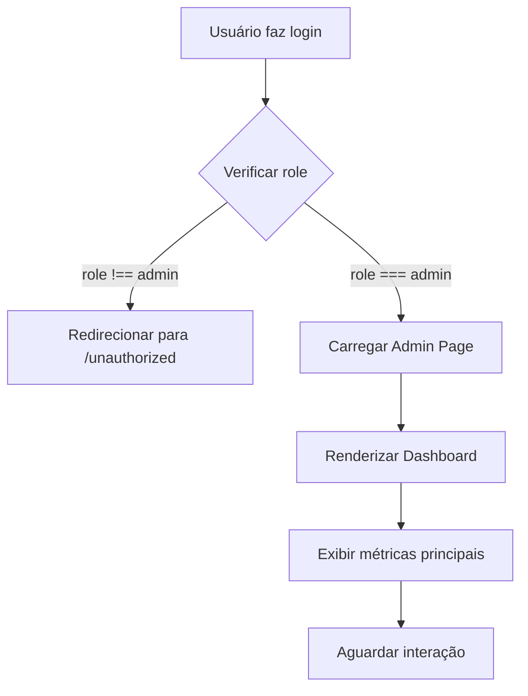
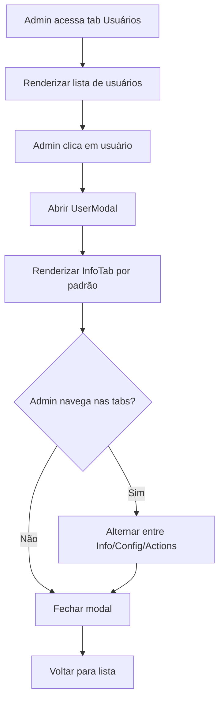
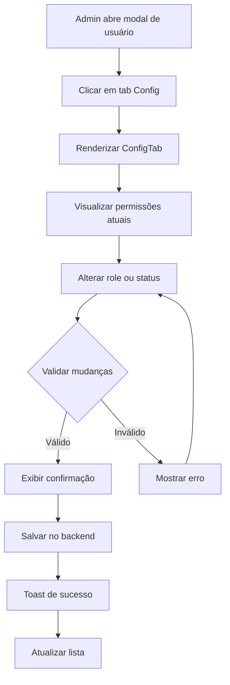
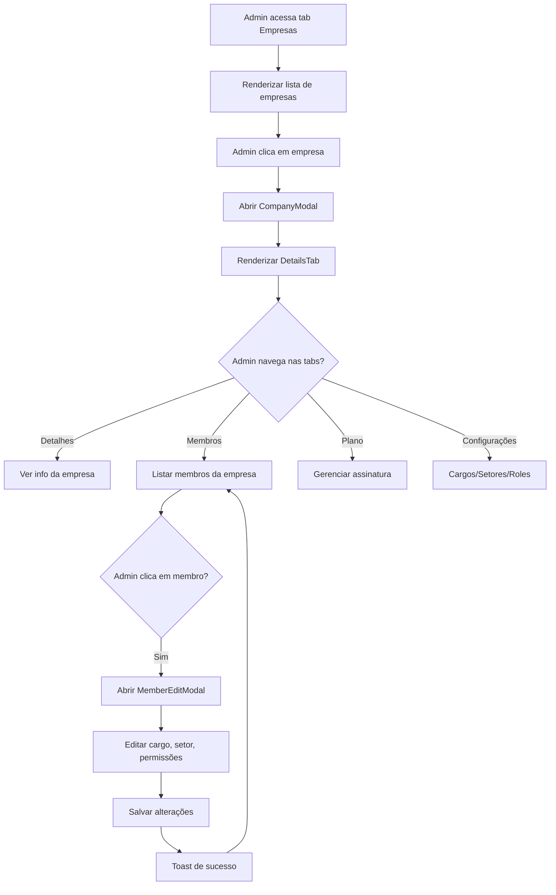
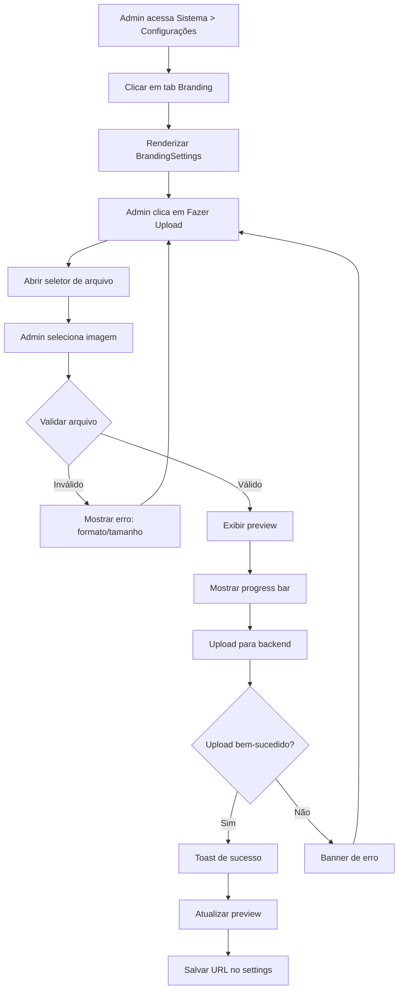
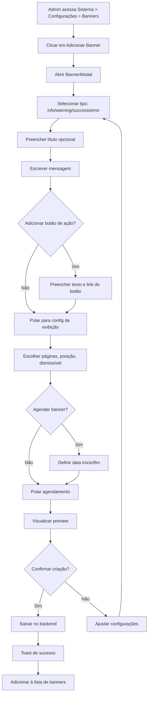
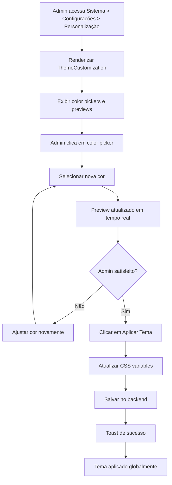

# 🔄 Fluxos de Usuário - Painel Superadmin

> **Versão:** 1.0.0
> **Data:** 2026-02-25
> **Responsável:** @ux-design-expert
> **Relacionado:** [[Admin-UX-Design-Guide]]

---

## 📋 Índice

1. [Fluxo Principal](#fluxo-principal)
2. [Gerenciamento de Usuários](#gerenciamento-de-usuários)
3. [Gerenciamento de Empresas](#gerenciamento-de-empresas)
4. [Configuração de Branding](#configuração-de-branding)
5. [Criação de Banners](#criação-de-banners)
6. [Personalização de Tema](#personalização-de-tema)

---

## 🏁 Fluxo Principal

### Acesso ao Painel Admin



**Wireframe Textual:**
```
┌─────────────────────────────────────────────────────────────────┐
│  [Logo] Painel Superadmin               [Theme Toggle] [Avatar] │
├─────────────────────────────────────────────────────────────────┤
│ SIDEBAR                  │ CONTENT AREA                          │
│ ┌─────────────────────┐ │ ┌───────────────────────────────────┐ │
│ │ ● Dashboard         │ │ │ Dashboard - Métricas Principais   │ │
│ │   Usuários          │ │ │                                   │ │
│ │   Empresas          │ │ │ [StatCard] [StatCard] [StatCard]  │ │
│ │   Sistema           │ │ │ [StatCard] [StatCard] [StatCard]  │ │
│ │                     │ │ │                                   │ │
│ │ [← Voltar]          │ │ │ [Gráfico de Planos]               │ │
│ └─────────────────────┘ │ │                                   │ │
│                          │ │ [Últimas Empresas Cadastradas]    │ │
│                          │ └───────────────────────────────────┘ │
└─────────────────────────────────────────────────────────────────┘
```

---

## 👥 Gerenciamento de Usuários

### Fluxo 1: Visualizar Detalhes de Usuário



**Wireframe - Lista de Usuários:**
```
┌─────────────────────────────────────────────────────────────────────┐
│ Usuários                                              [+ Novo Usuário]│
├─────────────────────────────────────────────────────────────────────┤
│ [🔍 Buscar por nome, email ou CPF...]          [x]                  │
│                                                                     │
│ [v Plano: Todos] [v Status: Todos] [v Tipo: Todos]  [1,247 results]│
├─────────────────────────────────────────────────────────────────────┤
│ NOME               EMAIL              PLANO        STATUS    AÇÕES │
│ ─────────────────────────────────────────────────────────────────  │
│ [👤] João Silva   joao@email.com    [Pro]       [Ativo]   [👁][✏][🗑] │
│ [👤] Maria Santos maria@email.com   [Enterprise][Ativo]   [👁][✏][🗑] │
│ [👤] Pedro Costa  pedro@email.com   [Free]      [Inativo] [👁][✏][🗑] │
│ ...                                                                 │
├─────────────────────────────────────────────────────────────────────┤
│                      [<] Página 1 de 42 [>]                         │
└─────────────────────────────────────────────────────────────────────┘
```

**Wireframe - Modal de Usuário:**
```
┌─────────────────────────────────────────────────────────────────────┐
│ Detalhes do Usuário                                          [X]    │
├─────────────────────────────────────────────────────────────────────┤
│ [ℹ Informações] [⚙ Configurações] [⚡ Ações]                        │
├─────────────────────────────────────────────────────────────────────┤
│                                                                     │
│  [👤 Avatar]    João Silva                                          │
│                 joao@email.com                                      │
│                 [Pro Badge]                                         │
│                                                                     │
│  INFORMAÇÕES PESSOAIS                                               │
│  ┌─────────────────────────────────────────────────────────────┐  │
│  │ Nome Completo:  João Silva                                  │  │
│  │ Email:          joao@email.com                              │  │
│  │ Telefone:       (11) 98765-4321                             │  │
│  │ CPF:            123.456.789-00                              │  │
│  │ Data Cadastro:  15/01/2024                                  │  │
│  └─────────────────────────────────────────────────────────────┘  │
│                                                                     │
│  EMPRESA VINCULADA                                                  │
│  ┌─────────────────────────────────────────────────────────────┐  │
│  │ [🏢] Tech Solutions LTDA                                     │  │
│  │      Professional Plan • 25 membros                         │  │
│  │      [Ver detalhes da empresa →]                            │  │
│  └─────────────────────────────────────────────────────────────┘  │
│                                                                     │
│                                           [Fechar] [Salvar Alterações]│
└─────────────────────────────────────────────────────────────────────┘
```

### Fluxo 2: Editar Permissões de Usuário



**Wireframe - ConfigTab:**
```
┌─────────────────────────────────────────────────────────────────────┐
│ Configurações do Usuário                                            │
├─────────────────────────────────────────────────────────────────────┤
│                                                                     │
│  PERMISSÕES                                                         │
│  ┌─────────────────────────────────────────────────────────────┐  │
│  │ Role:  (•) Usuário Comum                                    │  │
│  │        ( ) Superadmin                                       │  │
│  │                                                             │  │
│  │ ⚠ Atenção: Alterar para Superadmin concederá acesso total  │  │
│  │   ao painel administrativo. Use com cautela.               │  │
│  └─────────────────────────────────────────────────────────────┘  │
│                                                                     │
│  STATUS DA CONTA                                                    │
│  ┌─────────────────────────────────────────────────────────────┐  │
│  │ Status:  [v Ativo ▼]                                        │  │
│  │          • Ativo                                            │  │
│  │          • Inativo                                          │  │
│  │          • Suspenso                                         │  │
│  │          • Banido                                           │  │
│  └─────────────────────────────────────────────────────────────┘  │
│                                                                     │
│  NOTIFICAÇÕES                                                       │
│  ┌─────────────────────────────────────────────────────────────┐  │
│  │ [☑] Enviar email de confirmação ao alterar status          │  │
│  │ [☑] Notificar usuário sobre mudanças de permissão          │  │
│  └─────────────────────────────────────────────────────────────┘  │
│                                                                     │
│                                           [Cancelar] [Salvar Alterações]│
└─────────────────────────────────────────────────────────────────────┘
```

---

## 🏢 Gerenciamento de Empresas

### Fluxo 3: Visualizar e Editar Empresa



**Wireframe - CompanyModal (DetailsTab):**
```
┌─────────────────────────────────────────────────────────────────────┐
│ Tech Solutions LTDA                                          [X]    │
├─────────────────────────────────────────────────────────────────────┤
│ [📋 Detalhes] [👥 Membros] [💳 Plano] [⚙ Configurações]            │
├─────────────────────────────────────────────────────────────────────┤
│                                                                     │
│  INFORMAÇÕES DA EMPRESA                                             │
│  ┌─────────────────────────────────────────────────────────────┐  │
│  │ Razão Social:     Tech Solutions LTDA                       │  │
│  │ CNPJ:             12.345.678/0001-99                        │  │
│  │ Email:            contato@techsolutions.com                 │  │
│  │ Telefone:         (11) 3456-7890                            │  │
│  │ Data Cadastro:    10/12/2023                                │  │
│  │ Status:           [Ativo ✓]                                 │  │
│  └─────────────────────────────────────────────────────────────┘  │
│                                                                     │
│  PLANO ATUAL                                                        │
│  ┌─────────────────────────────────────────────────────────────┐  │
│  │ [Pro Badge]                                                 │  │
│  │ Professional Plan                                           │  │
│  │ R$ 199,00/mês                                               │  │
│  │ Renovação: 10/03/2024                                       │  │
│  │ [📊 Ver histórico de pagamentos]                            │  │
│  └─────────────────────────────────────────────────────────────┘  │
│                                                                     │
│  ESTATÍSTICAS                                                       │
│  ┌─────────────────────────────────────────────────────────────┐  │
│  │ Total de Membros:      25                                   │  │
│  │ Usuários Ativos:       23                                   │  │
│  │ Tickets Abertos:       3                                    │  │
│  │ Integrações Ativas:    5                                    │  │
│  └─────────────────────────────────────────────────────────────┘  │
│                                                                     │
│                                                [Fechar] [Editar Empresa]│
└─────────────────────────────────────────────────────────────────────┘
```

**Wireframe - CompanyModal (MembersTab):**
```
┌─────────────────────────────────────────────────────────────────────┐
│ Tech Solutions LTDA - Membros                                [X]    │
├─────────────────────────────────────────────────────────────────────┤
│ [📋 Detalhes] [👥 Membros] [💳 Plano] [⚙ Configurações]            │
├─────────────────────────────────────────────────────────────────────┤
│                                                                     │
│  [🔍 Buscar membro...]                            25 membros        │
│                                                                     │
│  MEMBROS ATIVOS (23)                                                │
│  ┌─────────────────────────────────────────────────────────────┐  │
│  │ [👤] João Silva                                      [✏][🗑] │  │
│  │      joao@email.com                                         │  │
│  │      [Gerente] [Vendas] [Admin Badge]                       │  │
│  │      40h/semana • Ativo desde 10/12/2023                    │  │
│  ├─────────────────────────────────────────────────────────────┤  │
│  │ [👤] Maria Santos                                    [✏][🗑] │  │
│  │      maria@email.com                                        │  │
│  │      [Analista] [Marketing] [User Badge]                    │  │
│  │      30h/semana • Ativo desde 15/01/2024                    │  │
│  ├─────────────────────────────────────────────────────────────┤  │
│  │ ...                                                         │  │
│  └─────────────────────────────────────────────────────────────┘  │
│                                                                     │
│  MEMBROS INATIVOS (2)                                               │
│  ┌─────────────────────────────────────────────────────────────┐  │
│  │ [👤] Pedro Costa (Inativo)                           [✏][🗑] │  │
│  │      pedro@email.com                                        │  │
│  │      Último acesso: 20/01/2024                              │  │
│  └─────────────────────────────────────────────────────────────┘  │
│                                                                     │
│                                                           [Fechar]  │
└─────────────────────────────────────────────────────────────────────┘
```

### Fluxo 4: Editar Membro da Empresa

```mermaid
graph TD
    A[Admin clica em [✏] do membro] --> B[Abrir MemberEditModal]
    B --> C[Carregar dados atuais]
    C --> D[Renderizar formulário]
    D --> E[Admin edita campos]
    E --> F{Validar mudanças}
    F -->|Válido| G[Confirmar alterações]
    F -->|Inválido| H[Mostrar erro inline]
    G --> I[Salvar no backend]
    I --> J[Toast de sucesso]
    J --> K[Atualizar lista de membros]
    K --> L[Fechar modal]
    H --> E
```

**Wireframe - MemberEditModal:**
```
┌─────────────────────────────────────────────────────────────────────┐
│ Editar Membro - João Silva                                   [X]    │
├─────────────────────────────────────────────────────────────────────┤
│                                                                     │
│  INFORMAÇÕES BÁSICAS                                                │
│  ┌─────────────────────────────────────────────────────────────┐  │
│  │ Nome:  [João Silva                               ]          │  │
│  │ Email: [joao@email.com                           ]          │  │
│  │ Tel:   [(11) 98765-4321                          ]          │  │
│  └─────────────────────────────────────────────────────────────┘  │
│                                                                     │
│  CARGO E SETOR                                                      │
│  ┌─────────────────────────────────────────────────────────────┐  │
│  │ Cargo: [v Gerente ▼]                                        │  │
│  │        • Gerente                                            │  │
│  │        • Analista                                           │  │
│  │        • Assistente                                         │  │
│  │        • [+ Criar novo cargo]                               │  │
│  │                                                             │  │
│  │ Setor: [v Vendas ▼]                                         │  │
│  │        • Vendas                                             │  │
│  │        • Marketing                                          │  │
│  │        • Suporte                                            │  │
│  │        • [+ Criar novo setor]                               │  │
│  └─────────────────────────────────────────────────────────────┘  │
│                                                                     │
│  CARGA HORÁRIA                                                      │
│  ┌─────────────────────────────────────────────────────────────┐  │
│  │ Horas semanais: [40] h/semana                               │  │
│  │                                                             │  │
│  │ Horário de trabalho:                                        │  │
│  │ Início: [09:00] Fim: [18:00]                                │  │
│  └─────────────────────────────────────────────────────────────┘  │
│                                                                     │
│  PERMISSÕES                                                         │
│  ┌─────────────────────────────────────────────────────────────┐  │
│  │ Role: [v Admin ▼]                                           │  │
│  │       • Admin (acesso total)                                │  │
│  │       • User (acesso básico)                                │  │
│  │       • Guest (acesso restrito)                             │  │
│  └─────────────────────────────────────────────────────────────┘  │
│                                                                     │
│                                    [Cancelar] [Salvar Alterações]  │
└─────────────────────────────────────────────────────────────────────┘
```

---

## 🎨 Configuração de Branding

### Fluxo 5: Upload de Logo



**Wireframe - BrandingSettings:**
```
┌─────────────────────────────────────────────────────────────────────┐
│ Branding e Identidade Visual                                       │
├─────────────────────────────────────────────────────────────────────┤
│                                                                     │
│  LOGO DA PLATAFORMA                                                 │
│  ┌─────────────────────────────────────────────────────────────┐  │
│  │                                                             │  │
│  │  ┌────────┐                                                 │  │
│  │  │        │    [Fazer Upload]  [Remover Logo]              │  │
│  │  │ [IMG]  │                                                 │  │
│  │  │        │    ✓ Formatos: PNG, JPG, SVG                   │  │
│  │  └────────┘    ✓ Tamanho máximo: 2MB                       │  │
│  │                ✓ Dimensões: 200x200px                      │  │
│  │                                                             │  │
│  └─────────────────────────────────────────────────────────────┘  │
│                                                                     │
│  NOME DA PLATAFORMA                                                 │
│  ┌─────────────────────────────────────────────────────────────┐  │
│  │ [Plataforma                                               ] │  │
│  │ Este nome aparecerá na barra de título, emails e notificações │  │
│  └─────────────────────────────────────────────────────────────┘  │
│                                                                     │
│  PREVIEW EM TEMPO REAL                                              │
│  ┌─────────────────────────────────────────────────────────────┐  │
│  │ ┌─────────────────────────────────────────────────────────┐ │  │
│  │ │ [🖼 Logo] Plataforma                                    │ │  │
│  │ └─────────────────────────────────────────────────────────┘ │  │
│  └─────────────────────────────────────────────────────────────┘  │
│                                                                     │
│  FAVICON                                                            │
│  ┌─────────────────────────────────────────────────────────────┐  │
│  │  ┌────┐                                                     │  │
│  │  │[⭐]│    [Upload Favicon]                                 │  │
│  │  └────┘                                                     │  │
│  │          Formatos: .ico, .png                               │  │
│  │          Dimensões: 16x16, 32x32 ou 64x64px                 │  │
│  └─────────────────────────────────────────────────────────────┘  │
│                                                                     │
│                                                [Salvar Configurações]│
└─────────────────────────────────────────────────────────────────────┘
```

**Estados de UI:**

**1. Upload em Progresso:**
```
┌────────────────────────────────────────┐
│ Fazendo upload...                      │
│ ▓▓▓▓▓▓▓▓░░░░░░░░░░░░░░░░░░░░░░ 35%    │
└────────────────────────────────────────┘
```

**2. Sucesso:**
```
┌────────────────────────────────────────┐
│ ✓ Logo atualizada com sucesso          │
│   A nova logo será exibida em toda     │
│   a plataforma.                         │
└────────────────────────────────────────┘
```

**3. Erro:**
```
┌────────────────────────────────────────┐
│ ⚠ Erro ao fazer upload                 │
│   O arquivo é muito grande. Máximo: 2MB│
└────────────────────────────────────────┘
```

---

## 📢 Criação de Banners

### Fluxo 6: Criar Banner de Aviso



**Wireframe - BannerModal:**
```
┌─────────────────────────────────────────────────────────────────────┐
│ Adicionar Banner                                             [X]    │
├─────────────────────────────────────────────────────────────────────┤
│                                                                     │
│  TIPO DO BANNER                                                     │
│  ┌─────────────────────────────────────────────────────────────┐  │
│  │ [ℹ️ Info]  [⚠️ Warning]  [✅ Success]  [❌ Error]             │  │
│  │    ▲                                                        │  │
│  │  Selecionado                                                │  │
│  └─────────────────────────────────────────────────────────────┘  │
│                                                                     │
│  TÍTULO (OPCIONAL)                                                  │
│  ┌─────────────────────────────────────────────────────────────┐  │
│  │ [Ex: Manutenção programada                              ]  │  │
│  └─────────────────────────────────────────────────────────────┘  │
│                                                                     │
│  MENSAGEM *                                                         │
│  ┌─────────────────────────────────────────────────────────────┐  │
│  │ [Escreva a mensagem do banner...                        ]  │  │
│  │ [                                                        ]  │  │
│  │ [                                                        ]  │  │
│  └─────────────────────────────────────────────────────────────┘  │
│  0/200 caracteres                                                   │
│                                                                     │
│  [☑] Adicionar botão de ação                                       │
│  ┌─────────────────────────────────────────────────────────────┐  │
│  │ Texto do botão: [Saiba mais                            ]   │  │
│  │ Link:           [/subscription                          ]   │  │
│  └─────────────────────────────────────────────────────────────┘  │
│                                                                     │
│  CONFIGURAÇÕES DE EXIBIÇÃO                                          │
│  ┌─────────────────────────────────────────────────────────────┐  │
│  │ Exibir em: [v Todas as páginas ▼]                          │  │
│  │ Posição:   [v Topo da página ▼]                             │  │
│  │                                                             │  │
│  │ [☑] Permitir que usuários fechem o banner                  │  │
│  │ [☐] Ocultar automaticamente após [5] segundos              │  │
│  └─────────────────────────────────────────────────────────────┘  │
│                                                                     │
│  AGENDAMENTO (OPCIONAL)                                             │
│  ┌─────────────────────────────────────────────────────────────┐  │
│  │ Data início: [____/__/____ __:__]                          │  │
│  │ Data fim:    [____/__/____ __:__]                          │  │
│  └─────────────────────────────────────────────────────────────┘  │
│                                                                     │
│  PREVIEW                                                            │
│  ┌─────────────────────────────────────────────────────────────┐  │
│  │ ┏━━━━━━━━━━━━━━━━━━━━━━━━━━━━━━━━━━━━━━━━━━━━━━━━━━━━━━━┓  │  │
│  │ ┃ ℹ️ Manutenção programada                            [X]┃  │  │
│  │ ┃ A plataforma ficará em manutenção no dia 01/03.        ┃  │  │
│  │ ┃ [Saiba mais →]                                          ┃  │  │
│  │ ┗━━━━━━━━━━━━━━━━━━━━━━━━━━━━━━━━━━━━━━━━━━━━━━━━━━━━━━━┛  │  │
│  └─────────────────────────────────────────────────────────────┘  │
│                                                                     │
│                                           [Cancelar] [Criar Banner] │
└─────────────────────────────────────────────────────────────────────┘
```

**Lista de Banners:**
```
┌─────────────────────────────────────────────────────────────────────┐
│ Banners e Avisos                               [+ Adicionar Banner] │
├─────────────────────────────────────────────────────────────────────┤
│                                                                     │
│  ┌─────────────────────────────────────────────────────────────┐  │
│  │ ℹ️ MANUTENÇÃO PROGRAMADA                          [✓ Ativo] │  │
│  │    A plataforma ficará em manutenção no dia 01/03.          │  │
│  │                                                             │  │
│  │    🌐 Todas as páginas • 📍 Topo • ✖️ Dismissível          │  │
│  │    📅 28/02/2024 - 01/03/2024                               │  │
│  │                                                             │  │
│  │    Preview: [Banner azul com ícone e botão]        [✏][🗑] │  │
│  └─────────────────────────────────────────────────────────────┘  │
│                                                                     │
│  ┌─────────────────────────────────────────────────────────────┐  │
│  │ ⚠️ ATUALIZAÇÃO IMPORTANTE                        [  Inativo] │  │
│  │    Nova versão disponível! Faça backup antes de atualizar.  │  │
│  │                                                             │  │
│  │    🌐 Apenas Dashboard • 📍 Topo • ✖️ Dismissível          │  │
│  │                                                             │  │
│  │    Preview: [Banner amarelo com ícone]             [✏][🗑] │  │
│  └─────────────────────────────────────────────────────────────┘  │
│                                                                     │
└─────────────────────────────────────────────────────────────────────┘
```

---

## 🎨 Personalização de Tema

### Fluxo 7: Alterar Cores do Tema



**Wireframe - ThemeCustomization:**
```
┌─────────────────────────────────────────────────────────────────────┐
│ Personalização de Cores                                             │
├─────────────────────────────────────────────────────────────────────┤
│                                                                     │
│  COR PRIMÁRIA                                                       │
│  ┌─────────────────────────────────────────────────────────────┐  │
│  │  ┌────┐  [#9333ea                              ]  [Resetar] │  │
│  │  │[■] │                                                     │  │
│  │  └────┘  Formato: #RRGGBB                                   │  │
│  │                                                             │  │
│  │  Preview: [50] [100] [500] [600] [900]                      │  │
│  │           ┌──┐ ┌──┐ ┌──┐ ┌──┐ ┌──┐                         │  │
│  │           │  │ │  │ │  │ │  │ │  │                         │  │
│  │           └──┘ └──┘ └──┘ └──┘ └──┘                         │  │
│  └─────────────────────────────────────────────────────────────┘  │
│                                                                     │
│  GRADIENTE DE BOTÕES                                                │
│  ┌─────────────────────────────────────────────────────────────┐  │
│  │  ┌────┐ → ┌────┐                              [Resetar]     │  │
│  │  │[■] │   │[■] │                                            │  │
│  │  └────┘   └────┘                                            │  │
│  │                                                             │  │
│  │  Preview:                                                   │  │
│  │  ┌────────────────────────────────────┐                    │  │
│  │  │      [Botão de Exemplo]            │ ← Gradient aplicado│  │
│  │  └────────────────────────────────────┘                    │  │
│  └─────────────────────────────────────────────────────────────┘  │
│                                                                     │
│  ┌─────────────────────────────────────────────────────────────┐  │
│  │ ⚠️ Atenção: Alterações de cor afetarão toda a plataforma.  │  │
│  │    Certifique-se de testar em diferentes páginas e modos.   │  │
│  └─────────────────────────────────────────────────────────────┘  │
│                                                                     │
│                           [Visualizar Preview] [Aplicar Tema]      │
└─────────────────────────────────────────────────────────────────────┘
```

---

## 🎯 Fluxos de Erro Comuns

### Erro 1: Upload Falhou
```
Trigger: Upload de arquivo > 2MB
┌─────────────────────────────────────────┐
│ ⚠️ Erro ao fazer upload                 │
│    O arquivo é muito grande.            │
│    Tamanho máximo: 2MB                  │
│    Arquivo enviado: 3.5MB               │
│                                         │
│    [Tentar novamente] [Escolher outro] │
└─────────────────────────────────────────┘
```

### Erro 2: Formato Inválido
```
Trigger: Upload de arquivo .pdf
┌─────────────────────────────────────────┐
│ ⚠️ Formato não suportado                │
│    Apenas PNG, JPG e SVG são aceitos.   │
│                                         │
│    [OK]                                 │
└─────────────────────────────────────────┘
```

### Erro 3: Falha ao Salvar Configurações
```
Trigger: Erro no backend
┌─────────────────────────────────────────┐
│ ❌ Erro ao salvar configurações         │
│    Não foi possível conectar ao         │
│    servidor. Tente novamente.           │
│                                         │
│    [Tentar novamente] [Cancelar]       │
└─────────────────────────────────────────┘
```

### Erro 4: Validação de Formulário
```
Trigger: Campo obrigatório vazio
┌─────────────────────────────────────────┐
│ Mensagem *                              │
│ [                                    ] │
│ ⚠️ Este campo é obrigatório            │
└─────────────────────────────────────────┘
```

---

## 📱 Fluxos Responsivos (Mobile)

### Mobile: Navegação Principal

**Smartphone (< 768px):**
```
┌────────────────────────┐
│ [☰] Admin    [🌙] [👤] │
├────────────────────────┤
│                        │
│  Dashboard             │
│  ┌──────────────────┐ │
│  │ [Card Métrica]   │ │
│  │ Total: 1,247     │ │
│  └──────────────────┘ │
│                        │
│  ┌──────────────────┐ │
│  │ [Card Métrica]   │ │
│  │ MRR: R$ 156k     │ │
│  └──────────────────┘ │
│                        │
├────────────────────────┤
│ [🏠] [👥] [🏢] [⚙️]    │ Bottom Nav
└────────────────────────┘
```

### Mobile: Modal Full Screen

**Smartphone:**
```
┌────────────────────────┐
│ [←] Detalhes  [Save] │
├────────────────────────┤
│ [ℹ️] [⚙️] [⚡]         │
├────────────────────────┤
│                        │
│  [👤 Avatar]           │
│  João Silva            │
│  [Pro Badge]           │
│                        │
│  INFORMAÇÕES           │
│  Email:                │
│  joao@email.com        │
│                        │
│  Telefone:             │
│  (11) 98765-4321       │
│                        │
│  CPF:                  │
│  123.456.789-00        │
│                        │
│  [Ver empresa →]       │
│                        │
│        ⋮               │
│                        │
└────────────────────────┘
```

---

## 🎬 Animações de Transição

### 1. Modal Open
```
Frame 1 (0ms):   Backdrop opacity 0%, Modal scale 95%
Frame 2 (50ms):  Backdrop opacity 25%, Modal scale 97%
Frame 3 (100ms): Backdrop opacity 50%, Modal scale 99%
Frame 4 (150ms): Backdrop opacity 100%, Modal scale 100%
```

### 2. Toast Notification
```
Frame 1 (0ms):   translateX(100%), opacity 0%
Frame 2 (100ms): translateX(50%), opacity 50%
Frame 3 (200ms): translateX(0%), opacity 100%
[Wait 3000ms]
Frame 4 (3200ms): translateX(100%), opacity 0%
```

### 3. Tab Transition
```
Frame 1 (0ms):   Old content opacity 100%
Frame 2 (100ms): Old content opacity 0%, New content opacity 0%
Frame 3 (200ms): New content opacity 100%
```

---

## ✅ Checklist de Validação de Fluxos

### Antes de Implementar
- [ ] Todos os fluxos principais mapeados
- [ ] Estados de erro identificados
- [ ] Mensagens de sucesso definidas
- [ ] Animações especificadas
- [ ] Versão mobile contemplada
- [ ] Acessibilidade considerada

### Durante Implementação
- [ ] Seguir wireframes exatamente
- [ ] Validar todos os inputs
- [ ] Implementar loading states
- [ ] Testar fluxos de erro
- [ ] Validar responsividade

### Após Implementação
- [ ] Testar todos os fluxos manualmente
- [ ] Validar acessibilidade (keyboard navigation)
- [ ] Testar em diferentes resoluções
- [ ] Verificar performance (sem lag)
- [ ] Obter feedback de usuário

---

## 🔗 Referências

- [[Admin-UX-Design-Guide]] - Guia completo de componentes
- [[Admin-Refactoring-Plan]] - Plano de refatoração
- [[Admin-New-Features]] - Funcionalidades detalhadas

---

**Última Atualização:** 2026-02-25
**Responsável:** @ux-design-expert
**Status:** ✅ Completo
